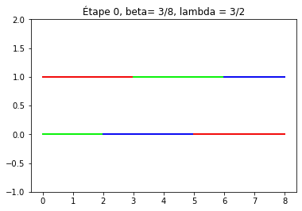

# Rauzy-Veech Induction for affine interval exchanges


A Python implementation of the **Rauzy-Veech induction** — a renormalization algorithm on interval exchange transformations (IETs), central to the study of translation surfaces and ergodic theory.


---

## What is the Rauzy-Veech induction?

An **interval exchange transformation** (IET) is defined by a permutation of subintervals of $[0, 1]$. The Rauzy-Veech induction is an algorithm analogous to the Euclidean algorithm, applied iteratively to IETs: at each step, it returns a new IET that is a first-return map of the original on a slightly smaller interval.

This process reveals the arithmetic and dynamical nature of the IET:
- **periodic orbit** → the induction cycle closes after finitely many steps
- **irrational rotation number** → the algorithm runs periodically

---

## Features

- One step of the Rauzy-Veech induction (`renorm`) with exact arithmetic via `fractions.Fraction`
- Detection of **periodic orbits** and **irrational rotation numbers**
- Automatic **normalization** of interval lengths at each step
- **Visualization** of the top/bottom interval partitions at each iteration using `matplotlib`
- Example script with hardcoded parameters for quick testing

---

## Project structure

```
.
├── Rauzy_Veech.py     # Core algorithm: one step of the induction, normalization, helpers
├── segments.py        # Visualization: plots the top/bottom interval decomposition
├── Essais_v1_1_2.py   # Example: runs the induction loop for (β,λ) examples
├── Essais             # Tests: Returns a text document with the Rauzy Veech Induction applied to a family of (β,λ) examples
├── assets/
│   └── RV.gif         # Demo animation
└── README.md
```

---

## Installation

```bash
git clone https://github.com/your-username/rauzy-veech
cd rauzy-veech
pip install matplotlib
```

> Python's standard library covers the rest (`fractions`, `tkinter`, `math`).

---

## Usage

### Run the example

```bash
python Essais_v1_1_2.py
```

The **(β, λ) example** consists of the only piecewise linear homeomorphism of the circle that:
- has exactly three breakpoints including 0 and β,
- has slope 1 on a right neighbourhood of 0 and slope λ on [β, 0],
- sends the breakpoint between 0 and β onto 0.

This runs the induction for fixed parameters `β = 3/8` and `λ = 3/2`, iterating until:
- the configuration returns to its initial state (periodic orbit), or
- the configuration reaches the zero vector (irrational rotation number), or
- the maximum of 25 iterations is reached.

At each step, a plot of the interval partition is displayed.

### Example output


```
Parameters: beta = 3/8, lambda = 3/2
Irrational rotation number
```

### Use the core module

```python
from fractions import Fraction
from Rauzy_Veech import renorm, normalisation, getcoef, segment

# Define permutations and lengths
toptab  = [1, 2, 0]
bottab  = [2, 0, 1]
ltoptab = [Fraction(1,3), Fraction(1,3), Fraction(1,3)]
lbottab = [Fraction(1,4), Fraction(1,2), Fraction(1,4)]

# One step of the induction
coef = getcoef(toptab, bottab, ltoptab, lbottab)
toptab, bottab, ltoptab, lbottab = renorm(toptab, bottab, ltoptab, lbottab, coef)

# Visualize
segment(toptab, bottab, ltoptab, lbottab, k=1)
```

---

## Parameters

| Parameter | Description |
|-----------|-------------|
| `toptab` / `bottab` | Permutations defining the IET (as integer arrays) |
| `ltoptab` / `lbottab` | Lengths of top/bottom intervals (`fractions.Fraction`) |

---

## Results and perspective ? 

We obtained new examples of rational piecewise linear maps of the circle with irrational rotation number. We also studied, while not included in this project, the case of AIET with algebraic numbers as parameters. An interesting next step would be to implement the case of piecewise PSL(2,Z) or PSL(2,k) IET.  

---

## Mathematical background

This implementation follows the classical construction of Rauzy-Veech induction as described in:

- **Yoccoz, J.-C.** — *Échanges d'intervalles*, Cours du Collège de France (2005)
- **S. Marmi, P. Moussa, J-C Yoccoz** — *Affine interval exchanges maps with a wandering interval* (2009)

---

## Author

**Théo V.**  
Feel free to reach out via [LinkedIn](https://linkedin.com/in/your-profile) or [email](mailto:your@email.com)

---

## License

MIT
